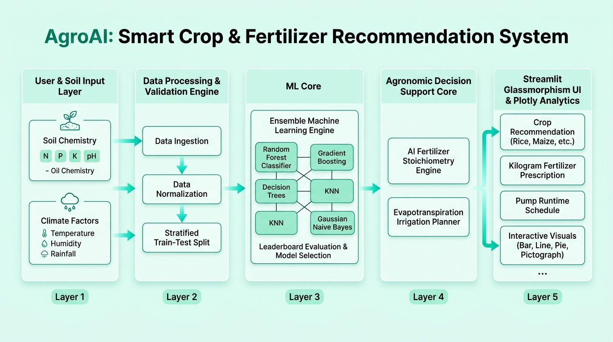

# 🌱 AgroAI: Smart Crop & Fertilizer Recommendation System

[](https://www.python.org/)
[](https://streamlit.io/)
[](https://scikit-learn.org/)
[](LICENSE)

An Enterprise-Grade, Machine Learning-powered Precision Agriculture Decision Support Platform. **AgroAI** combines multi-model ensemble classifiers, soil stoichiometric chemistry calculations, dynamic evapotranspiration ($ET_c$) water budgeting, and intuitive agricultural analytics to empower farmers, agronomists, and researchers.

---

## 🏛️ System Architecture



The platform is designed in 5 modular architectural layers:
1. **User & Soil Input Layer**: Gathers laboratory soil chemistry metrics ($N, P, K, \text{pH}$, Soil Texture) and environmental weather forecasts (Temperature, Humidity, Rainfall).
2. **Data Processing & Validation Pipeline**: Ingests and validates the 2,200-row `Crop_Recommendation.csv` dataset with stratified splitting and feature normalization.
3. **Multi-Model Machine Learning Core**: Simultaneously trains and evaluates 6 ML algorithms, selecting the highest-performing model for real-time inference.
4. **Agronomic Decision Support Core**: Computes dynamic fertilizer deficits (Urea, DAP, MOP, SSP, Vermicompost, Lime/Gypsum) and precision daily irrigation runtimes.
5. **UI & Analytics Layer**: Modern Streamlit interface with a pure light white-and-green bio-theme and 4 dedicated chart modules (*Bar Charts, Line Graphs, Pie Charts, Pictographs*).

---

## ✨ Key Features

- **🌾 Multi-Model Crop Recommendation Engine**:
  - Predicts optimal crops across 22 varieties based on soil nutrients and climatic parameters.
  - Generates confidence probability distributions for alternative crop options.
- **🧪 Dynamic AI Fertilizer Prescription Engine**:
  - Calculates exact nutrient deficits ($N, P, K$) considering soil texture (leaching vs. fixation) and target yield.
  - Automatically adjusts for soil acidity/alkalinity by prescribing Agricultural Lime or Gypsum.
  - Provides exact kilogram doses, bag counts, and application timing schedules.
- **💧 Dynamic Smart Irrigation Planner**:
  - Implements FAO-56 Penman-Monteith Evapotranspiration ($ET_c$) models based on crop growth stages, VPD, and temperature.
  - Calculates daily water volumes, pump runtimes (hours/minutes), and accounts for effective rainfall credits.
- **📈 Dedicated 4-Chart Analytics Module**:
  - **Bar Charts**: Multi-nutrient comparisons across crop families.
  - **Line Graphs**: 120-day water consumption and nutrient uptake curves.
  - **Pie Charts**: Soil nutrient balance proportions and crop family shares.
  - **Pictographs**: Intuitive icon-based visual comparisons for rainfall and nitrogen demand.
- **💰 Instant Fertilizer Cost & Budget Calculator**:
  - Real-time bag requirement and expenditure estimation with custom acreage and subsidy controls.
- **🛡️ Plant Doctor & Botanical Almanac**:
  - Integrated pest management (IPM) guidelines and organic farm-made bio-pesticide formulations.

---

## 🤖 Machine Learning Algorithms

| Algorithm | Model Type | Purpose |
| :--- | :--- | :--- |
| **Random Forest Classifier** | Ensemble Bagging | Primary classification engine with high non-linear feature interaction accuracy (>99%) |
| **Gradient Boosting Classifier** | Ensemble Boosting | Sequential decision boundary optimization |
| **Decision Tree Classifier** | Tree-based | Fast rule-based interpretability |
| **K-Nearest Neighbors (KNN)** | Instance-based | Local soil condition proximity mapping |
| **Gaussian Naive Bayes** | Probabilistic | Baseline likelihood estimation |
| **Multinomial Logistic Regression** | Linear Model | Multi-class baseline benchmark |

---

## 📊 Dataset Structure (`Crop_Recommendation.csv`)

The dataset contains 2,200 verified agricultural data points across 22 distinct crop classes:
- **`N`**: Ratio of Nitrogen content in soil ($\text{mg/kg}$)
- **`P`**: Ratio of Phosphorus content in soil ($\text{mg/kg}$)
- **`K`**: Ratio of Potassium content in soil ($\text{mg/kg}$)
- **`temperature`**: Ambient temperature in degree Celsius (°C)
- **`humidity`**: Relative humidity percentage (%)
- **`ph`**: Soil pH level ($0.0 - 14.0$)
- **`rainfall`**: Precipitation depth in millimeters ($\text{mm}$)
- **`label`**: Target crop class (*Rice, Maize, Chickpea, Kidney Beans, Pigeonpeas, Mothbeans, Mungbean, Blackgram, Lentil, Pomegranate, Banana, Mango, Grapes, Watermelon, Muskmelon, Apple, Orange, Papaya, Coconut, Cotton, Jute, Coffee*)

---

## 🚀 Installation & Quick Start

### Method 1: Using the 1-Click Batch File (Windows)
Double-click `setup_and_run.bat` in the project root folder. It will install all dependencies and launch the application.

### Method 2: Manual Terminal Setup

1. **Clone the repository**:
   ```bash
   git clone https://github.com/<YOUR-USERNAME>/<YOUR-REPO-NAME>.git
   cd <YOUR-REPO-NAME>
   ```

2. **Create and activate a virtual environment (optional but recommended)**:
   ```bash
   python -m venv venv
   # On Windows:
   venv\Scripts\activate
   # On macOS/Linux:
   source venv/bin/activate
   ```

3. **Install dependencies**:
   ```bash
   pip install -r requirements.txt
   ```

4. **Launch the Streamlit Web Application**:
   ```bash
   streamlit run main.py
   ```
   Open your browser and navigate to `http://localhost:8501`.

---

## 📁 Project Structure

```
├── .streamlit/
│   └── config.toml                  # Streamlit Light Bio-Theme configuration
├── assets/
│   └── system_architecture_diagram.jpg # High-resolution architecture blueprint
├── Crop_Recommendation.csv          # 2,200-row agricultural dataset
├── main.py                          # Core application engine & UI
├── requirements.txt                 # Python dependencies
├── setup_and_run.bat                # 1-click Windows runner script
├── INSTALL_AND_RUN.txt              # Notepad setup guide
├── .gitignore                       # Git ignore file
└── README.md                        # Project documentation
```

---

## 📜 License
This project is licensed under the MIT License.
